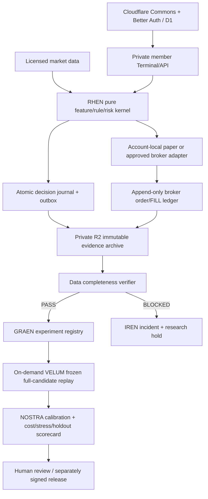

# ANEVUM vNext: greenfield platform contract (design only)

**Status:** proposed, not deployed; release name vNext is provisional.  
**Owner tracking:** #468; existing incomplete evidence issue #467 and unmerged research PR #466.  
**Policy:** do not restart/migrate current live founder RHEN or merge this proposal into `main` without an explicit maintenance and broker-exposure preflight.

## Product + security boundaries

| Plane | Roles and contract |
| --- | --- |
| ANEVUM Commons | React/TS/Vite Cloudflare Worker, current Better Auth + D1, community/content/supporter membership. No private broker data. |
| RHEN Account | Founder legacy account remains alone in existing deployed RHEN; successor starts separate repo and paper-only Railway staging. Future member accounts share pooled compute but get independent scoped strategy, risk, cash, permissions and broker token. |
| Evidence Vault | Lossless complete decision/rejection source archive, immutable content SHA, indexed outbox/WAL, market/quote/universe references, broker order/FILL lineage and per-horizon outcomes. |
| Research Lab | Offline deterministic GRAEN hypotheses, typed Strategy Genome, NOSTRA point-in-time forecast/calibration, VELUM same-engine replay, sealed holdout and signed Evidence Passport. No live broker credentials. |
| IREN | Deterministic schedule, source completeness, broker protection, queued job health, incident dedup, Slack webhook, truthful Command status, spend/latency budget. No required LLM. |

### Deployment starting point

- Retain existing `anevum-web` Worker + member D1. Do not rewrite auth from scratch.
- Retain existing founder live `anevum/rhen:main` as independent legacy service; not a testing sandbox.
- Develop `rhen-next` in a **new independent codebase** and staging deployment only when authorized. No founder OAuth or broker-write secrets in the new staging environment.
- Begin with SQLite WAL/outbox on private persistent storage for successor single-account hot state and **private Cloudflare R2** for full immutable batch archives. Maintain off-host backups with proven restore, source manifests, and configured retention/bucket locks. A Railway volume is not a backup.
- Research jobs are isolated and **on-demand** (Python, DuckDB/Parquet/Polars), not permanent servers. Prefer a typed modular monolith with no Kafka/Kubernetes/Redis/GPU by default.
- Introduce a managed PostgreSQL control database when multiple accounts/jobs require leases and transactional concurrency; keep large immutable bars/candidates in R2. Never depend on autosuspending free DB for a live safety-critical order.
- Market data acquired once per licensed feed, batched/deduplicated across permitted internal users; this does **not** grant public redistribution rights.

The research journal is written **before any UI sampling**. It is never optional telemetry and is not subject to pressure-induced rejection sampling. Broker protective orders must never wait on R2, but missing capture makes the affected research session BLOCKED and triggers a documented safe new-entry policy in the successor.

## Immutable decision-cycle contract

Every engine decision cycle records:

- `envelope_version, event_id, workspace_id, broker_account_id, run_id, cycle_id, sequence_no`;
- UTC observed/committed/ingested time, New York session identity and exchange calendar;
- `strategy_version, config_sha256, git_sha, feature_schema_version, execution_mode`;
- `market_feed, entitlement, actual latency, bar/quote watermarks, data freshness`;
- point-in-time `universe_snapshot_id`, expected/evaluated symbol counts, complete candidate/rejection array, all admission/risk reasons;
- deduplicated raw as-of market/bar/quote references, integrity SHA and upstream archive ACK;
- fill/order/protective-stop event IDs and separately matured 5m/15m/60m outcomes.

**Required invariants:** sequence continuity; unique IDs; one persisted outcome for every evaluated symbol; `candidate_count == considered_count`; `qualified + rejected + explicitly unmeasurable == considered`; every outcome is `COMPLETE` or reason-coded `MISSING/NOT_MATURED`; time of prediction precedes its future observation; no silent missing data; no fixed page caps misreported as full history. Archive source objects are append-only, content hashed, restored in an automated integrity drill; corrections append a new version.

R2 layout: `environment/workspace/session/schema/kind/part-N.jsonl.zst` for immutable journal batches, Parquet for derived queryable research. A manifest binds source ID, exact event-count, byte size, source feed license, from/to sequence and SHA-256 checksums. Index/query projections may be sampled, never the source.

## Deterministic engine design

`market_source` (feed entitlement/as-of calendar), `universe` (point-in-time membership), `features` (pure completed-bar calculations), `strategy_rules` (restricted typed AST), `portfolio` (account-local ledger), `risk` (protective order and safety policy), `broker_adapter` (paper + later approved OAuth), `journal`, `replay`, `projection`.

Use **the same pure strategy and risk functions** for paper/live and VELUM. Live broker IO is a separate adapter; research/replay workers hold no live order credentials. Each account has a single-writer/fenced lock and deterministic idempotent client-order IDs. No order changes from AI-generated text, social/community actions, subscriptions or external web callbacks.

## Actual research, not a scheduled-success illusion

State transitions: `PROPOSED -> SOURCE_AUDIT -> DEVELOPMENT -> WALK_FORWARD -> HOLDOUT -> SHADOW -> REVIEWED`. Any missing evidence yields `AWAITING_EVIDENCE` or `BLOCKED`. A successful null result is a *completed experiment*; a complete backtest that found no edge is useful.

GRAEN proposes explicitly bounded rule changes, including rule *structures*, not only parameters; freezes control, candidate universe, code/container/environment hashes, filters and cost model before evaluation. VELUM evaluates all original decision opportunities using account-local capital, order limits, slippage/spread, stops, partial fills and EOD mechanics. NOSTRA forecasts are recorded before outcomes and compared with trivial baselines. Walk-forward must be chronologically separate; HOLDOUT must be unopened during selection. Include session-level dependence, multiplicity adjustment, foregone winners, drawdown, net expectancy, and opportunity costs. Do not claim alpha from 3 days or only the subset of trades that actually filled.

Innovations to implement as view/contract features: **Decision Twin**, **Strategy Genome**, **Counterfactual Lab**, **Evidence Passport**, **Shadow Portfolios**, and a community-facing **Research Commons** that never exposes owner raw fills or prohibited licensed market data.

## Users, realtime and commercially sensitive boundaries

- ANEVUM member identity is stable across products. Distinct founder/admin, private member workspace, broker-account scope and signed capabilities. Challenge unauthorized tenant queries in unit/API/WebSocket/R2 tests.
- Realtime uses a committed snapshot plus versioned event sequence/SSE; add Cloudflare Durable Objects hibernating WebSockets after demand. A gap or disconnected market is `STALE`, not a flat market chart. Server publishes only data authorized for that user.
- Member capability states: `VIEW -> RESEARCH -> PAPER -> (later) LIVE`. Stripe supporter badge is separate from broker authorization or strategy quality.
- Alpaca OAuth approval, account-specific encrypted tokens, a security/operational audit and US regulatory legal review are prerequisites for member live automated trading. This is **not** Alpaca Broker API onboarding and cannot be implied by Stripe payments. No broker funding transfers inside ANEVUM during initial release.

## Cost gates

- Cloudflare D1 (free 5GB / 100k rows written daily) is for community/member data, **not** per-symbol trading decisions.
- R2 (10GB Standard included, no egress) is the source archive; project object write/batch counts and storage by daily universe budget.
- Workers Free / Cloudflare Queues have hard daily limits; batch social jobs, not raw market events.
- PostHog free analytics is for page, feature and product behavior only; disable PII/token/fill collection.
- Railway Hobby $5 monthly included usage is a minimum, **not** a promise current 1.35 GB-average-memory founder runtime will cost $5.
- Alpaca Basic is IEX-only live equities, not consolidated SIP; paid $99/month Algo Trader Plus is a separate future data-feed decision, with market-data redistribution governed by license.

Capacity sanity: 100 symbols x 390 1-minute cycles = 39,000 candidate observations/session. At hypothetical 2 KB per observed row, that is ~78MB raw/session plus deduplicated bar/quote history, or ~1.7GB for 22 sessions before compression. Track observed bytes rather than extrapolating low-usage tests to all symbols and extended hours.

## Implementation and release gates

| Gate | Evidence of completion |
| --- | --- |
| 0 Safety/baseline | Founder source/deployment, broker exposure, state backup, rollback captured. New code has zero founder credentials. |
| 1 Prospective source | Every real evaluated and rejected candidate survives WAL, R2 archive, checksum and restore; injected restart/overwrite/duplicate/gap tests pass. |
| 2 Temporal evidence | Point-in-time universe/feed/bar/quote states preserved and full 5/15/60m maturation lineage; missing statuses honest. |
| 3 Broker/replay parity | Real paper order and partial-fill lineage agrees with broker source; stop/time/cash behavior matches identical deterministic replay. |
| 4 Real research | One full source-population control/challenger run can be replayed twice bit-for-bit, with cost stress and no alpha claim implied. |
| 5 Pipeline stability | At least 5 consecutive market sessions have no missing source decisions, complete integrity ledger and recovery drill. This does not prove a winning strategy. |
| 6 Member isolation | Two pilot accounts never read, control or receive one another's or the founder's broker/research data, including stale socket and forged URL cases. |
| 7 Approved growth | Paper beta then legal + Alpaca app approval; live account rollout separately signed and rollback verified. |

**Build order:** baseline + contracts -> lossless Evidence Vault first -> market/outcome recorder + shared paper engine -> verifier/on-demand GRAEN/VELUM -> IREN integrity/cost state -> member Command + Commons paper beta -> independent holdout -> optionally approved member live. The UI can proceed against mocks in parallel after contracts freeze.

## Links

- Major overhaul acceptance issue #468: https://github.com/anevum/rhen/issues/468
- Existing research work #467: https://github.com/anevum/rhen/issues/467
- Incomplete draft research PR #466: https://github.com/anevum/rhen/pull/466
- Lean-runtime merged change #449: https://github.com/anevum/rhen/pull/449

**No implementation approval inferred:** this is a proposed design. No live RHEN change or production deployment is authorized by merging a documentation PR.
