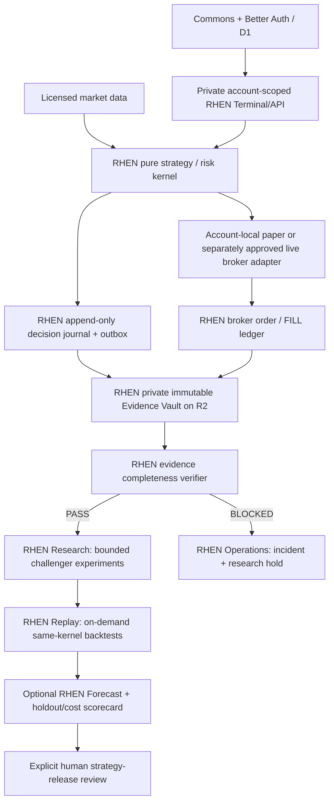

# ANEVUM V5 — FOUNDATION: greenfield platform contract

**Status:** OWNER-LOCKED ARCHITECTURE for development on 2026-10-09; implementation staged, no production release authorized.  
**Program ID:** `ANEVUM.V5.FOUNDATION.2026-10-09.001`; owner tracking #468; research blocker #467 and draft #466. Website Commons V5.1 shell is draft `anevum/anevum-web#256`; ANEVUM V5 is the overarching program, not a claim that either app is production version 5.  
**Policy:** do not restart/migrate current live founder RHEN or merge this proposal into `main` without an explicit maintenance and broker-exposure preflight. **Locked product consolidation:** RHEN is the sole near-term trading/research/operations product. GRAEN, VELUM and NOSTRA are historical prototypes whose useful ideas are internal RHEN modules. IREN is postponed; see [decision 002](2026-10-10-rhen-integrated-prototype-consolidation.md).

## Product + security boundaries

| Plane | Roles and contract |
| --- | --- |
| ANEVUM Commons | React/TS/Vite Cloudflare Worker, current Better Auth + D1, community/content/supporter membership. No private broker data. |
| RHEN | **One application** with deterministic market ingestion, scanner, strategy/risk engine, paper/live broker adapter (separate approval), account-scoped operations and authentic research data. Founder legacy remains isolated; successor starts paper-only. |
| RHEN Evidence Vault | Lossless capture and immutable archive of every evaluated/rejected candidate, point-in-time bars/universe and broker order/FILL lineage; an internal RHEN data layer, not a separate app. |
| RHEN Research | Internal on-demand experiments and rule-set verification (incorporates ideas from the **GRAEN prototype**); no independent always-on server or broker-write credentials. |
| RHEN Replay | Internal on-demand full-market deterministic backtesting (incorporates ideas from the **VELUM prototype**); same pure strategy/risk engine and sealed holdout. |
| RHEN Forecast | Optional offline feature/forecast calibration (incorporates ideas from the **NOSTRA prototype**); not a live strategy dependency without independent authorization. |
| RHEN Operations | Lightweight native schedule/health/evidence integrity/incident reporting; no separate IREN service required. |
| Future IREN | **Deferred project**, potentially a local GPU/hosted AI and cross-application operator after RHEN is reliable and affordable; its absence must not degrade RHEN risk controls or monitoring. |

**Prototype policy:** do not ship or describe GRAEN/VELUM/NOSTRA as separate production apps. Keep historical references and consumers working while the successor absorbs tested functionality. Same codebase does not require same process; launch isolated, bounded research/replay jobs when requested, without live order privileges.

### Legacy data waiver — owner decision 2026-10-09

The owner explicitly authorized **discarding the old RHEN 4.3.2 Railway on-volume data** rather than upgrading to Railway Pro for snapshots or building a historical database migration. The legacy system's execution was disarmed in its Railway deployment, and the detached shadow volume has already been deleted. A permanent site retirement/cutover is being developed in [anevum-web PR #260](https://github.com/anevum/anevum-web/pull/260); the remaining legacy service/volume must not be deleted until the public and protected website routes stop calling it.

This is **not** permission to discard code, V5 evidence, member accounts, member D1 data, or cloud-brokerage records. Preserve GitHub history and strict tenant isolation. The new RHEN Evidence Vault begins with freshly observed paper cycles and must capture every candidate and independent source reference. Never imply continuity, completeness or recovered research from the intentionally discarded old SQLite database.

### Deployment starting point

- Retain existing `anevum-web` Worker + member D1. Do not rewrite auth from scratch.
- Retain existing founder live `anevum/rhen:main` as independent legacy service; not a testing sandbox.
- Develop `rhen-next` in a **new independent codebase** and staging deployment only when authorized. No founder OAuth or broker-write secrets in the new staging environment.
- Begin with SQLite WAL/outbox on private persistent storage for successor single-account hot state and **private Cloudflare R2** for full immutable batch archives. Maintain off-host backups with proven restore, source manifests, and configured retention/bucket locks. A Railway volume is not a backup.
- RHEN's internal Research, Replay, and optional Forecast modules execute as isolated **on-demand** jobs (Python, DuckDB/Parquet/Polars), not permanent GRAEN/VELUM/NOSTRA servers. Prefer one typed RHEN modular monolith with no Kafka/Kubernetes/Redis/GPU by default. This does not preclude later GPU-based IREN.
- Introduce a managed PostgreSQL control database when multiple accounts/jobs require leases and transactional concurrency; keep large immutable bars/candidates in R2. Never depend on autosuspending free DB for a live safety-critical order.
- Market data acquired once per licensed feed, batched/deduplicated across permitted internal users; this does **not** grant public redistribution rights.

The research journal is written **before any UI sampling**. It is never optional telemetry and is not subject to pressure-induced rejection sampling. Broker protective orders must never wait on R2, but missing capture makes the affected research session BLOCKED and triggers a documented safe new-entry policy in the successor.

## Immutable decision-cycle contract

Every engine decision cycle records:

- `envelope_version, event_id, workspace_id, broker_account_id, run_id, cycle_id, sequence_no`;
- UTC observed/committed/ingested time, New York session identity and exchange calendar;
- `strategy_version, config_sha256, git_sha, feature_schema_version, execution_mode`;
- `market_feed, entitlement, actual latency, bar/quote watermarks, data freshness`;
- point-in-time `universe_snapshot_id`, expected/evaluated symbol counts, complete candidate/rejection array, all admission/risk reasons;
- deduplicated raw as-of market/bar/quote references, integrity SHA and upstream archive ACK;
- fill/order/protective-stop event IDs and separately matured 5m/15m/60m outcomes.

**Required invariants:** sequence continuity; unique IDs; one persisted outcome for every evaluated symbol; `candidate_count == considered_count`; `qualified + rejected + explicitly unmeasurable == considered`; every outcome is `COMPLETE` or reason-coded `MISSING/NOT_MATURED`; time of prediction precedes its future observation; no silent missing data; no fixed page caps misreported as full history. Archive source objects are append-only, content hashed, restored in an automated integrity drill; corrections append a new version.

R2 layout: `environment/workspace/session/schema/kind/part-N.jsonl.zst` for immutable journal batches, Parquet for derived queryable research. A manifest binds source ID, exact event-count, byte size, source feed license, from/to sequence and SHA-256 checksums. Index/query projections may be sampled, never the source.

## Deterministic engine design

`market_source` (feed entitlement/as-of calendar), `universe` (point-in-time membership), `features` (pure completed-bar calculations), `strategy_rules` (restricted typed AST), `portfolio` (account-local ledger), `risk` (protective order and safety policy), `broker_adapter` (paper + later approved OAuth), `journal`, `replay`, `projection`.

Use **the same pure strategy and risk functions** for paper/live and internal RHEN Replay (formerly VELUM). Live broker IO is a separate adapter; research/replay workers hold no live order credentials. Each account has a single-writer/fenced lock and deterministic idempotent client-order IDs. No order changes from AI-generated text, social/community actions, subscriptions or external web callbacks.

## Actual research, not a scheduled-success illusion

State transitions: `PROPOSED -> SOURCE_AUDIT -> DEVELOPMENT -> WALK_FORWARD -> HOLDOUT -> SHADOW -> REVIEWED`. Any missing evidence yields `AWAITING_EVIDENCE` or `BLOCKED`. A successful null result is a *completed experiment*; a complete backtest that found no edge is useful.

RHEN Research (formerly GRAEN) proposes explicitly bounded rule changes, including rule *structures*, not only parameters; freezes control, candidate universe, code/container/environment hashes, filters and cost model before evaluation. RHEN Replay (formerly VELUM) evaluates all original decision opportunities using account-local capital, order limits, slippage/spread, stops, partial fills and EOD mechanics. Optional RHEN Forecast (formerly NOSTRA) predictions must be recorded before outcomes and compared with trivial baselines; forecasting is not required for a correct research pipeline. Walk-forward must be chronologically separate; HOLDOUT must be unopened during selection. Include session-level dependence, multiplicity adjustment, foregone winners, drawdown, net expectancy, and opportunity costs. Do not claim alpha from 3 days or only the subset of trades that actually filled.

Innovations to implement as view/contract features: **Decision Twin**, **Strategy Genome**, **Counterfactual Lab**, **Evidence Passport**, **Shadow Portfolios**, and a community-facing **Research Commons** that never exposes owner raw fills or prohibited licensed market data.

## Users, realtime and commercially sensitive boundaries

- ANEVUM member identity is stable across products. Distinct founder/admin, private member workspace, broker-account scope and signed capabilities. Challenge unauthorized tenant queries in unit/API/WebSocket/R2 tests.
- Realtime uses a committed snapshot plus versioned event sequence/SSE; add Cloudflare Durable Objects hibernating WebSockets after demand. A gap or disconnected market is `STALE`, not a flat market chart. Server publishes only data authorized for that user.
- Member capability states: `VIEW -> RESEARCH -> PAPER -> (later) LIVE`. Stripe supporter badge is separate from broker authorization or strategy quality.
- Alpaca OAuth approval, account-specific encrypted tokens, a security/operational audit and US regulatory legal review are prerequisites for member live automated trading. This is **not** Alpaca Broker API onboarding and cannot be implied by Stripe payments. No broker funding transfers inside ANEVUM during initial release.

## Cost gates

- Cloudflare D1 (free 5GB / 100k rows written daily) is for community/member data, **not** per-symbol trading decisions.
- R2 (10GB Standard included, no egress) is the source archive; project object write/batch counts and storage by daily universe budget.
- Workers Free / Cloudflare Queues have hard daily limits; batch social jobs, not raw market events.
- PostHog free analytics is for page, feature and product behavior only; disable PII/token/fill collection.
- Railway Hobby $5 monthly included usage is a minimum, **not** a promise current 1.35 GB-average-memory founder runtime will cost $5.
- Alpaca Basic is IEX-only live equities, not consolidated SIP; paid $99/month Algo Trader Plus is a separate future data-feed decision, with market-data redistribution governed by license.

Capacity sanity: 100 symbols x 390 1-minute cycles = 39,000 candidate observations/session. At hypothetical 2 KB per observed row, that is ~78MB raw/session plus deduplicated bar/quote history, or ~1.7GB for 22 sessions before compression. Track observed bytes rather than extrapolating low-usage tests to all symbols and extended hours.

## Implementation and release gates

| Gate | Evidence of completion |
| --- | --- |
| 0 Safety/baseline | Founder source/deployment, broker exposure, state backup, rollback captured. New code has zero founder credentials. |
| 1 Prospective source | Every real evaluated and rejected candidate survives WAL, R2 archive, checksum and restore; injected restart/overwrite/duplicate/gap tests pass. |
| 2 Temporal evidence | Point-in-time universe/feed/bar/quote states preserved and full 5/15/60m maturation lineage; missing statuses honest. |
| 3 Broker/replay parity | Real paper order and partial-fill lineage agrees with broker source; stop/time/cash behavior matches identical deterministic replay. |
| 4 Real research | One full source-population control/challenger run can be replayed twice bit-for-bit, with cost stress and no alpha claim implied. |
| 5 Pipeline stability | At least 5 consecutive market sessions have no missing source decisions, complete integrity ledger and recovery drill. This does not prove a winning strategy. |
| 6 Member isolation | Two pilot accounts never read, control or receive one another's or the founder's broker/research data, including stale socket and forged URL cases. |
| 7 Approved growth | Paper beta then legal + Alpaca app approval; live account rollout separately signed and rollback verified. |

**Build order:** baseline + Commons contracts -> RHEN lossless Evidence Vault -> market/outcome recorder + shared paper engine -> integrated RHEN Research/Replay -> native RHEN Operations integrity/cost alerts -> optional RHEN Forecast behind research gates -> private member Command + Commons paper beta -> unseen holdout and separately approved live trading. **IREN is deferred** and not on the V5 critical path. Website UI work proceeds against explicit schemas and honest unavailable states.

## Links

- Prototype consolidation decision: [002 — RHEN integrated](2026-10-10-rhen-integrated-prototype-consolidation.md)
- Major overhaul acceptance issue #468: https://github.com/anevum/rhen/issues/468
- Existing research work #467: https://github.com/anevum/rhen/issues/467
- Incomplete draft research PR #466: https://github.com/anevum/rhen/pull/466
- Lean-runtime merged change #449: https://github.com/anevum/rhen/pull/449

**The owner locked this design for development, not production release.** No live RHEN change or production deployment is authorized by merging this documentation PR.
