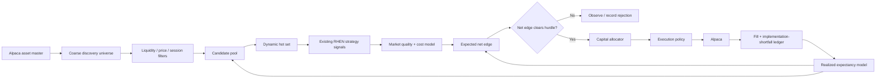

# RHEN v4 — Wide-Universe Opportunity Engine

Status: DESIGN READY  
Target: next major RHEN equity release  
Date: 2026-10-06  
Owner: ANEVUM  
Primary runtime: `anevum/alpaca-trader` / Railway RHEN production

## 1. Release intent

RHEN v4 turns the existing working equity trader into a **wide-universe, cost-aware capital allocator**.

The objective is not maximum trade count. The objective is:

> maximize expected **net** profit from available capital and infrastructure by widening the opportunity set, rejecting negative-EV trades, and allocating more capital to stronger opportunities.

This release keeps the current proven execution, risk, reconciliation, and session machinery. It does not introduce another parallel trading subsystem.

## 2. Current baseline

The current code already has the correct foundation:

- `DynamicUniverse` discovers Alpaca-tradable equities and ranks a candidate pool.
- `score_opportunity()` ranks signals using momentum, VWAP edge, confirmations, spread, freshness, relative volume, and trend persistence.
- `calculate_entry_notional()` already supports risk-based sizing and portfolio stop-risk limits.
- regular-session RHEN uses persistent multi-bar momentum logic.
- a separate extended-equity execution regime already handles premarket, after-hours, and overnight order constraints.
- correlation checks already exist.
- Railway production currently runs one main `alpaca-trader` service plus the BTC paper canary, with no staged infrastructure changes.

The release therefore extends and consolidates existing components instead of replacing them.

## 3. Hard prerequisite

PR #387 — **Stop duplicate per-symbol scan telemetry flood** — must be merged and verified before the broad-universe release is enabled.

Reason: a larger candidate pool would multiply the current per-symbol durable scan-event volume. RHEN v4 must keep detailed per-symbol scan state in memory/operator history while persisting only bounded decision-cycle evidence.

No universe expansion should be enabled in production until this prerequisite is complete.

## 4. Non-goals

RHEN v4 does **not**:

- add a new Railway service;
- make crypto the primary opportunity source;
- add futures execution;
- enable options trading;
- enable HTB shorting;
- enable OTC/microcap trading by default;
- require Alpaca Algo Trader Plus;
- remove existing authorization, drawdown, cash, reconciliation, or stop-risk gates;
- increase live risk merely because the candidate pool is larger.

Options, futures, and specialized microcap strategies remain later releases.

## 5. Canonical architecture



The critical separation is:

1. **Know about many symbols.**
2. **Evaluate fewer symbols deeply.**
3. **Trade only a small ranked subset.**

A large discovery universe must never imply a large number of simultaneous positions.

## 6. Universe design

### 6.1 Asset master

Refresh Alpaca asset metadata on a low-frequency schedule.

Include active, tradable U.S. equities on supported exchanges. Maintain metadata for:

- symbol;
- exchange;
- tradable;
- fractionable;
- shortable;
- easy-to-borrow where available;
- overnight eligibility;
- latest capability refresh timestamp.

Do not require `fractionable=true` for the entire discovery universe.

Instead maintain two eligibility classes:

- **fractional core** — preferred for small-account allocation;
- **whole-share eligible** — allowed only when one whole share fits the current per-position capital ceiling.

This increases the available pool without making high-priced non-fractionable assets impossible to trade.

### 6.2 Instrument priority

Initial priority order:

1. broad/index ETFs;
2. highly liquid large-cap stocks;
3. sector/industry ETFs;
4. liquid midcaps;
5. selected liquid small caps;
6. leveraged/inverse ETFs under separate risk labels;
7. liquid REITs;
8. liquid ADRs;
9. lower-priced liquid equities under stricter spread/tick rules.

Default quarantine:

- OTC;
- sub-$5 securities unless explicitly admitted by a dedicated low-price policy;
- microcaps with weak dollar liquidity;
- symbols with abnormal corporate-action or halt state;
- HTB shorts;
- products whose spread/cost model cannot be estimated reliably.

### 6.3 Three-stage universe

Use three distinct counts instead of overloading `UNIVERSE_SIZE`.

Recommended starting envelope on current resources:

- **eligible asset master:** all qualifying Alpaca U.S. equities;
- **daily candidate pool:** up to 500;
- **live hot set:** up to 30 on the current Basic-data budget.

The daily pool may grow beyond 500 later, but the live hot set should remain bounded until data-plan economics justify wider streaming.

### 6.4 Coarse discovery filters

Initial engineering defaults for the tiny-edge core:

- price >= $5;
- average daily share volume >= 1,000,000;
- average daily dollar volume >= $100,000,000;
- rolling realized volatility within a broad usable band;
- no stale/corporate-action hazard;
- current session supports the instrument.

These are defaults, not immutable laws. GRAEN may later prove that a looser segment is profitable, but it must be promoted with evidence.

### 6.5 Hot-set promotion

Candidate-pool ranking should use inexpensive features first:

- dollar liquidity;
- range/realized volatility;
- relative volume;
- gap;
- multi-bar momentum;
- sector/index relative strength;
- current spread;
- quote freshness;
- session.

Only the best candidates enter the live hot set.

Hot-set membership should rotate. A symbol that loses liquidity, becomes wide-spread, or loses signal quality should yield its slot to a stronger candidate.

## 7. Net-edge model

The existing score is useful for **ordering**, but v4 adds an economic gate.

For candidate `i`:

```
expected_net_bps_i =
    expected_gross_bps_i
  - expected_spread_cost_bps_i
  - expected_slippage_bps_i
  - expected_regulatory_bps_i
  - expected_router_bps_i
  - expected_borrow_bps_i
  - model_uncertainty_bps_i
```

Do not infer profitability from win rate or raw signal score.

### 7.1 Expected gross edge

Do not invent a fixed mapping from momentum to profit.

Use an empirical expectancy table keyed by at least:

- strategy/version;
- session;
- opportunity-score bucket;
- liquidity/spread bucket;
- volatility regime.

For insufficient sample sizes, use a conservative configured fallback and impose a larger uncertainty penalty.

### 7.2 Spread

Use current bid/ask spread, expressed in basis points.

The release must distinguish:

- current one-way spread burden;
- expected entry execution burden;
- expected exit execution burden;
- total expected round-trip spread burden.

### 7.3 Slippage

Begin with a conservative rolling estimate from RHEN's own fills.

Store implementation shortfall:

```
IS_bps = side * (fill_price - decision_mid) / decision_mid * 10,000
```

Use a conservative percentile, initially p75 or worse, until the live sample is mature.

### 7.4 Initial admission hurdle

Shadow defaults:

- minimum expected **net** edge: 5 bps;
- minimum gross-edge / expected-cost ratio: 2.0;
- higher hurdle outside regular hours.

These thresholds must be configurable and calibrated from actual RHEN fills before being loosened.

## 8. Opportunity ranking

Add a separate ranking metric for capital allocation:

```
capital_velocity =
    fill_probability
  * expected_net_dollars
  / (proposed_notional * expected_holding_minutes)
```

The engine should prefer opportunities that efficiently recycle capital.

Example consequence:

- one $50 high-quality candidate may outrank ten $5 marginal candidates;
- a small fast trade may outrank a larger trade that ties up capital for hours;
- idle cash is acceptable when no candidate clears the economic hurdle.

## 9. Position sizing

Keep the existing hard risk allocator as the outer safety envelope.

For each candidate calculate independent caps:

```
risk_cap
buying_power_cap
position_cap
portfolio_stop_risk_cap
liquidity_cap
correlation_cluster_cap
opportunity_cap
```

Then:

```
final_notional = min(all caps)
```

### 9.1 Opportunity multiplier

Do not use full Kelly in v4.

Apply a bounded opportunity multiplier to the existing safe risk notional.

Suggested shape:

```
edge_strength = clamp(expected_net_bps / full_size_edge_bps, 0, 1)
confidence    = clamp(empirical_confidence, 0, 1)

opportunity_multiplier =
    floor_multiplier
  + (1 - floor_multiplier) * edge_strength * confidence
```

Use a conservative floor only for candidates that already pass the net-edge gate.

### 9.2 Buying power

Use actual available buying power/cash as an explicit cap.

Do not increase leverage as part of this release. Capital recycling and better selection are the optimization targets.

### 9.3 Correlation

Existing pairwise correlation checks remain authoritative.

Add portfolio-level clustering later in the same release if tests are clean:

- broad market;
- technology/growth;
- financials;
- energy;
- defensive;
- rates/bonds;
- commodities;
- other discovered clusters.

A wider universe should diversify opportunity, not create five copies of the same factor bet.

## 10. Execution policy

### 10.1 Regular session

New entries should move toward a policy-selected limit workflow.

Decision inputs:

- live spread;
- expected alpha decay;
- fill probability;
- expected adverse selection;
- signal urgency.

Policy outputs:

- passive limit;
- marketable limit;
- skip.

Do not make an unbounded market order the default for tiny-edge entries.

Risk-reducing emergency exits remain allowed to prioritize certainty over spread capture.

### 10.2 Extended/overnight

Keep the existing session-specific lane and Alpaca-compatible limit-order constraints.

Do not duplicate the universe model. The extended lane should consume the same asset master and economic scoring primitives with session-specific thresholds.

Extended sessions begin with a higher cost/uncertainty hurdle.

## 11. Telemetry and evidence contract

Every evaluated candidate should be reproducible without durably writing every scan transition.

Persist one bounded `decision_cycle` record containing the top candidate set and reasons.

For each execution candidate record:

- cycle ID;
- symbol;
- session/feed;
- strategy version;
- raw opportunity score;
- predicted gross edge;
- observed spread;
- expected slippage;
- uncertainty reserve;
- expected net edge;
- fill probability;
- proposed notional;
- final notional;
- every binding sizing cap;
- correlation result;
- execution style;
- decision midpoint;
- submit timestamp;
- acknowledgement timestamp;
- fill timestamp;
- fill price;
- implementation shortfall;
- realized P&L;
- realized net bps;
- exit reason.

This ledger becomes the training/evaluation source for later GRAEN strategy promotion.

## 12. Command contract

Backend should expose an `opportunity_engine` section in the Command payload:

```json
{
  "opportunity_engine": {
    "enabled": false,
    "mode": "shadow",
    "asset_master_count": 0,
    "eligible_count": 0,
    "candidate_pool_count": 0,
    "hot_set_count": 0,
    "hot_set_limit": 30,
    "session": "regular",
    "top_candidates": [],
    "rejection_counts": {},
    "capital": {
      "available": "0",
      "allocated": "0",
      "reserved": "0"
    },
    "cost_model": {
      "sample_size": 0,
      "median_is_bps": null,
      "p75_is_bps": null
    }
  }
}
```

Command visualization should show:

- discovery funnel: asset master -> candidate pool -> hot set -> signals -> executable;
- ranked candidates with predicted gross/net edge;
- spread/slippage estimate;
- proposed notional;
- binding risk cap;
- current capital utilization;
- recent implementation shortfall;
- session and feed;
- reason rejected.

No decorative visualization that cannot be tied to actual telemetry.

## 13. Proposed configuration

All new behavior ships disabled.

```dotenv
OPPORTUNITY_ENGINE_ENABLED=false
OPPORTUNITY_ENGINE_MODE=shadow

UNIVERSE_CANDIDATE_POOL_SIZE=500
UNIVERSE_HOT_SET_SIZE=30
UNIVERSE_MIN_PRICE=5.00
UNIVERSE_MIN_AVG_VOLUME=1000000
UNIVERSE_MIN_AVG_DOLLAR_VOLUME=100000000

NET_EDGE_MIN_BPS=5
NET_EDGE_MIN_BPS_EXTENDED=10
MIN_GROSS_TO_COST_RATIO=2.0
COST_MODEL_MIN_SAMPLES=30
COST_MODEL_SLIPPAGE_PERCENTILE=0.75

ALLOCATION_MODE=edge_risk
ALLOCATION_FLOOR_MULTIPLIER=0.25
ALLOCATION_FULL_SIZE_EDGE_BPS=20
CAPITAL_RESERVE_PCT=0.10

EXECUTION_POLICY_ENABLED=false
EXECUTION_MAX_ENTRY_SPREAD_BPS=5
EXECUTION_EXTENDED_MAX_ENTRY_SPREAD_BPS=15

DECISION_CYCLE_PERSIST_TOP_N=30
```

Exact production values must be promoted from shadow evidence, not copied blindly from this document.

## 14. Code plan

### Existing files to extend

`app/universe.py`

- split asset master, candidate pool, and live hot set;
- support non-fractionable candidates when whole-share affordability passes;
- add current spread/session promotion logic;
- expose stage counts and reasons.

`app/opportunity.py`

- preserve current quality score;
- add economic estimate structures;
- add net-edge and capital-velocity score;
- add cost-model confidence/uncertainty.

`app/sizing.py`

- preserve current risk caps;
- add opportunity multiplier;
- include buying power explicitly;
- expose binding-cap diagnostics.

`app/execution.py`

- rank eligible buy candidates by expected net value/capital velocity;
- allocate sequentially against remaining capital/risk;
- add execution-policy decision;
- log decision midpoint and expected costs.

`app/market_data.py`

- add bounded/batched latest-quote acquisition for hot-set promotion;
- add request-budget awareness;
- preserve session-specific feed selection.

`app/extended_equity.py`

- consume shared opportunity/cost primitives;
- retain session-specific order mechanics.

`app/state.py`

- depend on PR #387 telemetry boundary;
- add bounded opportunity-engine snapshot only.

`app/main.py`

- expose the Command contract;
- include release/runtime provenance.

`app/persistence.py`

- add nullable economic/execution fields without breaking historical rows.

### New modules

Prefer at most two new focused modules:

- `app/execution_costs.py` — spread, slippage, regulatory and uncertainty model;
- `app/capital_allocator.py` — ranking and bounded allocation.

Do not create another scanner, another execution engine, or another service.

## 15. Test plan

### Unit

- asset-master eligibility;
- fractionable versus whole-share affordability;
- coarse filters;
- hot-set rotation;
- stale quote rejection;
- spread rejection;
- net-edge calculations;
- uncertainty penalty;
- capital-velocity ordering;
- opportunity multiplier;
- binding-cap reporting;
- correlation preservation;
- extended-session higher hurdle.

### Regression

All existing:

- strategy;
- execution;
- concurrent execution;
- dynamic universe;
- extended equity;
- risk;
- reconciliation;
- RHEN Core;
- IREN;
- crypto isolation

tests remain green.

### Integration

Simulate:

- 500 candidates -> <=30 hot symbols;
- multiple simultaneous positive signals;
- one high-quality versus many marginal candidates;
- capital exhaustion;
- partial fills;
- stale quotes;
- session handoff;
- restart with open positions;
- Alpaca 429/backoff behavior.

### Shadow acceptance

Before live promotion collect at least one full regular session and one extended-session observation window.

Require:

- no duplicate orders;
- no stale-data entry;
- no risk bypass;
- no unbounded telemetry growth;
- no material API-rate-limit errors;
- candidate evidence persisted exactly once per decision cycle;
- cost estimates and actual fills reconcilable;
- no unexplained position/account divergence.

## 16. Rollout sequence

### Phase 0 — prerequisite

Merge and validate PR #387.

### Phase 1 — instrumentation only

Deploy v4 with:

- opportunity engine enabled;
- mode = shadow;
- execution policy disabled;
- existing live strategy/execution unchanged.

Measure candidate funnel and execution-cost model.

### Phase 2 — economic gate shadow

Calculate net edge and proposed position sizes but do not alter orders.

Compare proposed decisions against actual RHEN trades.

### Phase 3 — allocator canary

Enable the new allocator for regular-session entries under existing risk ceilings.

No leverage expansion.

### Phase 4 — wide pool

Increase candidate pool toward 500 while hot set remains bounded.

Monitor API budget, CPU/memory, evidence volume, and Command latency.

### Phase 5 — execution policy

Enable passive/marketable-limit selection only after implementation-shortfall evidence is sufficient.

### Phase 6 — extended-session promotion

Apply the same economic gate outside RTH with stricter hurdles.

Promote premarket, after-hours, and overnight independently.

### Phase 7 — data-plan ROI decision

Only consider the paid Alpaca data plan if measured missed opportunity shows expected incremental net profit comfortably exceeds its recurring cost.

## 17. Release gates

The release is READY for live promotion only when all are true:

- PR #387 merged and telemetry growth verified;
- CI/staging checks green;
- no database/persistence regression;
- no current unresolved trading reconciliation incident;
- production service healthy;
- no staged Railway infrastructure changes;
- cost model produces bounded non-null values for executable candidates;
- hot set respects configured capacity;
- expected-net gate blocks negative/marginal candidates;
- final sizing never exceeds existing risk ceilings;
- operator can explain every order from persisted evidence;
- rollback by feature flag is tested.

## 18. Rollback

Rollback must not require code removal.

Primary rollback:

```
OPPORTUNITY_ENGINE_ENABLED=false
EXECUTION_POLICY_ENABLED=false
```

The existing RHEN dynamic/static universe and risk/execution paths remain available.

If the release causes operational pressure:

1. disable execution policy;
2. shrink hot set;
3. shrink candidate pool;
4. switch opportunity engine to shadow;
5. disable opportunity engine entirely.

## 19. Production architecture constraint

Do not add Railway services for this release.

Current RHEN production already has:

- `alpaca-trader`;
- `btc-canary-001-paper`;
- one persistent evidence volume on the main service.

The wide-universe work belongs inside the main RHEN service. Adding services would increase cost and operational complexity without solving the actual bottleneck.

## 20. Definition of done

RHEN v4 is done when:

- the system can discover a broad Alpaca equity/ETF universe;
- it dynamically maintains a small high-quality live hot set;
- every candidate is evaluated on expected **net** economics;
- position size varies with edge/confidence while remaining inside existing hard risk caps;
- simultaneous opportunities compete for capital rather than receiving equal allocation;
- RHEN can trade frequently without using trade count as the optimization target;
- extended-hours trading uses the same economic framework with stricter session rules;
- Command shows the real funnel, economics, allocation, and fills;
- GRAEN can use realized net expectancy as the basis for future strategy promotion.

The release principle is:

> **Broad discovery. Narrow execution. Variable allocation. Net expectancy first.**
