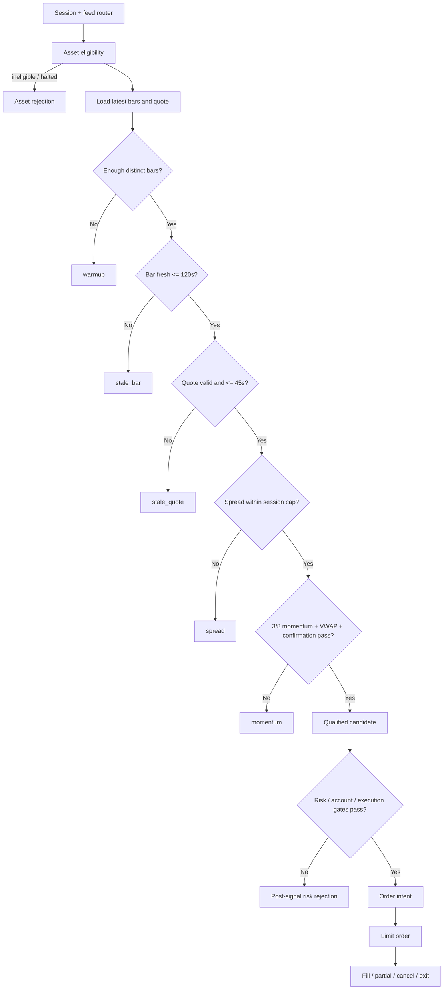

# RHEN Extended 24/5 Trading System Research Report

**Session:** `ANEVUM.RHEN.RESEARCH.2026-10-07.001.EXTENDED-24-5-TRADING`  
**Research date:** October 7, 2026, America/New_York  
**Scope:** Long-only U.S. equities and ETFs; options research-only with no options writes; equity shorting disabled; leverage expansion disabled; 24-symbol extended-hours observation universe.

## Executive summary

RHEN's present extended-hours architecture is **not ready for full live 24/5 promotion**, but the gap is narrower and more mechanical than it first appeared. The trading engine already contains much of the right safety structure: session-aware routing, explicit extended-hours authorization, limit-order-only behavior, feed-specific selection, stale-data and spread gates, an eight-observation slow window, session/feed cache resets, overnight eligibility checks, and a bounded 24-symbol target universe. The principal problem is that the **configured free-data architecture cannot provide fresh market data across the entire trading day RHEN is intended to observe**. fileciteturn10file0L2-L2 fileciteturn12file0L2-L2

The decisive architecture recommendation is:

> **Use Alpaca Algo Trader Plus as RHEN's primary execution-market-data source, route consolidated SIP data from 4:00 AM–8:00 PM ET, and route real-time BOATS data from 8:00 PM–4:00 AM ET. Keep all 24 symbols under observation continuously, but promote live execution gradually.**

Alpaca's Basic plan is free but supplies real-time equities data only from IEX. Algo Trader Plus currently costs **$99/month** and provides real-time data from all U.S. stock exchanges through CTA/UTP/SIP, removes the latest-15-minute historical restriction, raises historical request capacity from 200 to 10,000 calls per minute, and permits unlimited stock WebSocket subscriptions. citeturn19search0turn19search4 For the overnight period, Alpaca separately provides BOATS data from 8:00 PM–4:00 AM; paid users can request `feed=boats` for real-time latest quotes, trades, snapshots, and historical bars/quotes/trades. Free accounts get `feed=overnight`, where latest quotes are real-time but **indicative**, latest bars are available, and latest trades are 15 minutes delayed. citeturn19search2

That gives RHEN a clean present-day map:

| ET window | Current RHEN/free design | Structural problem | Recommended live source |
|---|---|---|---|
| 4:00–8:00 AM | IEX | IEX is not a full-market 4 AM source; current free route cannot represent the full extended market | **SIP** |
| 8:00–9:30 AM | IEX | Fresh, but only one exchange rather than consolidated U.S. market | **SIP** |
| 9:30 AM–4:00 PM | IEX/basic route where applicable | Single-venue view | **SIP** |
| 4:00–5:00 PM | IEX | Fresh but single-venue | **SIP** |
| 5:00–8:00 PM | IEX | Structural freshness gap after IEX's post-market session | **SIP** |
| 8:00 PM–4:00 AM | Alpaca `overnight` | Usable for observation, but quote is indicative and trades delayed | **BOATS** |

NYSE describes the present U.S. market structure as conventional extended trading from **4:00 AM through 8:00 PM**, followed by specialized overnight ATS operation from **8:00 PM to 4:00 AM**. CTA and UTP SIPs currently operate from 4:00 AM to 8:00 PM. citeturn19search1turn19search5 Alpaca's BOATS integration covers precisely the missing 8:00 PM–4:00 AM segment. citeturn19search2 This makes Alpaca SIP + BOATS the least-complex current architecture that closes RHEN's day without introducing a second vendor and a second normalization layer.

The existing **45-second quote-age** and **120-second bar-age** limits should stay. Those limits are not causing the problem; they are correctly detecting it. A feed that stops updating becomes unusable first at the quote gate, then at the bar gate. If a last usable quote were timestamped at 5:00:00 PM, it crosses RHEN's quote limit after roughly 5:00:45 and its bar limit after roughly 5:02:00. By 8:00 PM, such observations are hours old. Relaxing the thresholds to make that data pass would convert a feed problem into a trading-risk problem. RHEN's current configured thresholds are therefore appropriately fail-closed. fileciteturn10file0L2-L2

There are four other material blockers besides the feed:

1. RHEN's extended bar tape is still **process memory**, so a restart destroys signal warmup state. The slow window is eight distinct observations, and 30-second polling does not produce two observations per minute because duplicate timestamps replace each other. A cold restart therefore creates approximately eight minutes of signal blindness unless recent authoritative bars are bootstrapped. fileciteturn12file0L2-L2
2. The existing telemetry does not yet provide a durable, queryable **per-symbol rejection histogram**. The general rejection funnel is bounded in memory, making it insufficient for proving why zero candidates occurred during a multi-hour run. fileciteturn11file0L2-L2
3. The actual overnight eligibility of all 24 configured securities must be checked at runtime with Alpaca's `overnight_tradable` and `overnight_halted` attributes. Alpaca explicitly warns that nominally eligible NMS securities can still be restricted for compliance or risk reasons. citeturn19search2
4. RHEN needs at least one clean, deployment-frozen forward validation with the correct feeds. A strategy cannot be promoted merely because the data plumbing is repaired; signal frequency, spreads, fill quality, stale-data rate, restart behavior, and order lifecycle all need to be observed under the new source.

The promotion posture should therefore remain **NO-GO for unrestricted live EXTENDED 24/5 execution**, while the target architecture itself should now be considered sufficiently defined to implement.

## Current RHEN state and trading envelope

The user's policy envelope is stricter than what the brokerage may technically permit. RHEN should encode that policy directly rather than inferring permissions from broker capabilities:

| Capability | RHEN policy |
|---|---|
| U.S. equities | Long-only |
| U.S. ETFs | Long-only |
| Equity shorting | Disabled |
| Options | Research/observation only |
| Options order creation | Disabled |
| Options writing | Disabled |
| Margin/leverage expansion | Disabled |
| Overnight observation | Enabled target |
| Extended-hours execution | Explicit gated promotion only |
| Market orders during extended sessions | Prohibited |
| Stop orders as native extended orders | Prohibited |
| Extended-hours entries/exits | Limit orders only |

That policy fits the current extended-equity implementation. The engine's safety invariants specify no extended-hours market or stop orders, use limit orders with `extended_hours=true`, prevent casual adoption of regular-session positions into the extended lane, and explicitly gate live extended execution separately from the normal execution controls. fileciteturn12file0L2-L2 Alpaca likewise documents limit-order constraints for overnight trading. citeturn19search2

The repository configuration currently defines the target extended universe as:

**SPY, QQQ, IWM, DIA, AAPL, MSFT, NVDA, AMD, AMZN, META, GOOGL, TSLA, AVGO, NFLX, PLTR, COIN, MSTR, SMH, XLF, XLK, XLE, GLD, TLT, USO.** fileciteturn10file0L2-L2

That is a sensible structure for a small 24/5 scanner because it mixes highly liquid index ETFs, sector ETFs, large-cap technology/e-commerce equities, several higher-volatility momentum names, gold, Treasuries, and oil exposure. This report does **not** assert that all 24 are currently executable overnight every day. RHEN's own runtime code checks asset activity, tradability, fractionability, exchange eligibility, and, in overnight mode, Alpaca's `overnight_tradable` and `overnight_halted` attributes. The executable subset can therefore legitimately shrink while the configured observation universe remains 24. fileciteturn12file0L2-L2 Alpaca states that overnight availability can be restricted for compliance or risk even though NMS securities are broadly supported. citeturn19search2

The configuration also establishes the core signal and risk parameters that matter to after-hours behavior:

| Parameter | Current repository value | Interpretation |
|---|---:|---|
| Universe target | 24 | Target extended scanner breadth |
| Poll period | 30 s | Two scanner cycles/minute nominally |
| Universe refresh | 600 s | Asset eligibility refresh every 10 minutes |
| Fast window | 3 observations | Short momentum component |
| Slow window | 8 observations | Warmup floor / slower component |
| Minimum momentum | 0.0007 | 0.07% |
| Maximum VWAP extension | 0.006 | 0.60% |
| Max quote age | 45 s | Hard freshness gate |
| Max bar age | 120 s | Hard freshness gate |
| After-hours max spread | 0.004 | 0.40% |
| Overnight max spread | 0.006 | 0.60% |
| Entry limit buffer | 0.0005 | 5 bps |
| Stop reference | 0.004 | 0.40% |
| Target reference | 0.006 | 0.60% |
| Max hold | 45 min | Position time limit |
| Max entries/session | 3 | Turnover limit |
| Handoff-flat window | 5 min | Session transition protection |
| Weekend flat time | 19:45 ET | Friday risk cutoff |
| Extended feed | `iex` | Current configuration |
| Overnight feed | `overnight` | Current configuration |

These values come from the repository's example/configuration surface, not an assertion that the currently deployed Railway environment has identical effective values. In particular, the repository defaults are deliberately inert: extended lane enablement, extended execution, ordinary execution, arming, and live acknowledgement default off. That separation is desirable and should survive the redesign. fileciteturn10file0L2-L2

The engine also keeps SPY and QQQ as confirmation symbols. Because both are already in the 24-symbol list, this need not expand the ordinary universe, but their market-state role should be explicitly recorded in telemetry so a rejection caused by confirmation logic is not mislabeled as generic `momentum`. fileciteturn10file0L2-L2

One architecture rule should be locked now: **market-data entitlement and trading permission are separate concepts**. Alpaca says Trading API accounts are enabled for 24/5 trading by default, but that does not imply RHEN should trade every instrument the account technically permits. citeturn19search2 RHEN's own configuration should remain the narrower source of authority: long only, no options orders, no shorts, no expansion of leverage, and live extended execution off unless every promotion gate is satisfied.

## Market-data architecture, coverage, and freshness

The central distinction is between **a quote being recent** and **a quote representing the market RHEN is trying to trade**. Both matter.

Alpaca Basic gives equities users real-time IEX data, while Algo Trader Plus gives all-U.S.-exchange data based on CTA/UTP. Alpaca characterizes its SIP coverage as comprehensive U.S. market coverage; the paid plan currently costs $99/month. citeturn19search0turn19search4 IEX is still real market data, but a quote from one exchange is not the same thing as the consolidated best-priced opportunity available across U.S. venues. That distinction becomes more important in thinner extended sessions, where liquidity is fragmented and spreads can differ substantially venue to venue.

The current market clock can be represented as:

```mermaid
gantt
    title RHEN U.S. Equity Data Day — Current Recommended Routing
    dateFormat  HH:mm
    axisFormat  %H:%M

    section Premarket
    SIP             :active, 04:00, 5h30m

    section Regular
    SIP             :09:30, 6h30m

    section After-hours
    SIP             :16:00, 4h

    section Overnight
    BOATS           :crit, 20:00, 8h
```



NYSE currently describes ordinary U.S. extended market activity as beginning at 4:00 AM and ending at 8:00 PM, with specialized ATSs active from 8:00 PM to 4:00 AM. Both U.S. SIPs operate in the 4:00 AM–8:00 PM interval. citeturn19search1 Alpaca's documented overnight feed interval is exactly 8:00 PM–4:00 AM. citeturn19search2

**The 4:00 PM–8:00 PM problem.** NYSE Arca itself supports a late session through 8:00 PM. citeturn19search5 The existing RHEN route, however, is `iex`. The IEX trading schedule reviewed in the prior RHEN audit runs its post-market session only to 5:00 PM ET. citeturn541869search0 Therefore, RHEN's present design has a usable but single-venue 4:00–5:00 PM interval followed by a structural 5:00–8:00 PM data gap. SIP eliminates that gap and gives consolidated coverage until 8:00 PM. citeturn19search0turn19search1

**The 8:00 PM–4:00 AM period.** The free `overnight` feed is much better than stale IEX: Alpaca documents current latest bars, real-time indicative latest quotes, snapshots, and 15-minute-delayed trades. citeturn19search2 That is reasonable for shadow observation and may be enough to evaluate the scanner's logic, but a production execution system should prefer the market-data source aligned with the venue on which overnight orders are actually interacting. With Plus, `feed=boats` supplies real-time latest quotes and trades plus historical BOATS data. citeturn19search2

**The 4:00 AM–8:00 AM period.** This is already a genuine U.S. extended trading period; NYSE Arca's early session opens at 4:00 AM. citeturn19search5 Free IEX is therefore not an adequate whole-market source for this interval. SIP is. A 24/5 RHEN implementation that leaves `EXTENDED_EQUITY_DATA_FEED=iex` unchanged would fix overnight but remain blind or stale for a large part of premarket.

The resulting feed router should be conceptually this simple:

```text
04:00 <= ET < 20:00  -> sip
20:00 <= ET < 04:00  -> boats

Never:
    stale sip -> iex fallback -> trade
    stale boats -> overnight indicative -> trade silently
```

Fallback data can remain useful for **diagnostics**, but a change in feed quality must never silently lower the execution standard.

The freshness model should use both provider timestamps and RHEN receipt time. For each observation:

\[
A_q = t_{\mathrm{decision}} - t_{\mathrm{quote}}
\]

\[
A_b = t_{\mathrm{decision}} - t_{\mathrm{bar}}
\]

An entry is data-eligible only if:

\[
A_q \le 45\text{ s}
\quad\land\quad
A_b \le 120\text{ s}
\]

plus a valid two-sided market and a session-specific spread limit. Those 45-second and 120-second thresholds are already configured in RHEN. fileciteturn10file0L2-L2

For a valid bid and ask, the normalized spread should remain:

\[
S =
\frac{P_{\text{ask}}-P_{\text{bid}}}
{\left(P_{\text{ask}}+P_{\text{bid}}\right)/2}
\]

and the execution gate is:

\[
S \le
\begin{cases}
0.004,& \text{premarket/after-hours}\\
0.006,& \text{overnight}
\end{cases}
\]

based on RHEN's configured 40-basis-point extended and 60-basis-point overnight caps. fileciteturn10file0L2-L2

This is why the after-hours failure seen previously was correct behavior. Once a provider stops producing new quote timestamps, **staleness grows linearly with wall time regardless of whether the API continues returning HTTP 200**. An apparently valid JSON response containing a three-hour-old quote is not market data suitable for an entry decision.

The system should explicitly distinguish these conditions:

| Condition | Classification | Trade implication |
|---|---|---|
| No quote returned | `stale_quote` + subtype `missing` | Reject |
| Bid or ask absent/zero | `stale_quote` + subtype `not_two_sided` | Reject |
| Quote timestamp >45 s | `stale_quote` + subtype `age` | Reject |
| Future timestamp beyond clock tolerance | `stale_quote` + subtype `clock_skew` | Reject |
| Bar missing | `stale_bar` + subtype `missing` | Reject |
| Bar >120 s | `stale_bar` + subtype `age` | Reject |
| Fresh data, spread over cap | `spread` | Reject |
| Fresh/tight market, signal fails | `momentum` | Reject |
| Too few distinct observations | `warmup` | Reject |

The `snapshot` API itself exposes separate `sip`, `iex`, `delayed_sip`, `boats`, and `overnight` source choices, which makes explicit feed tagging straightforward. citeturn19search10 Every RHEN decision should store which of those sources actually produced the evidence.

There is also a near-term market-structure transition to watch. NYSE is progressing toward longer exchange and SIP operating hours, with an overnight session targeted as part of its 2026 expansion. citeturn19search3 RHEN should **not** remove BOATS or redesign around a future consolidated schedule merely because the industry has announced a transition. The system should keep the present SIP/BOATS router until the new SIP schedule is actually live, stable, available through Alpaca, and validated by RHEN. This avoids rebuilding around a regulatory/infrastructure timetable that may still change.

## Candidate generation, rejection taxonomy, and telemetry

The current RHEN data path should be converted from a loosely observable scanner into a **measurable decision funnel**. The important distinction is between a candidate not existing and the system being unable to evaluate whether a candidate exists.

The recommended order is:



The order matters. A symbol with a three-hour-old quote should not be described as a weak momentum signal. The system has no valid basis for making the momentum decision in the first place.

At the same time, storing only the **first** rejection can conceal secondary pathology. During a feed outage, `stale_quote` could mask the fact that bars are also stale. RHEN should therefore persist both:

```json
{
  "decision": "reject",
  "first_rejection": "stale_quote",
  "all_rejections": [
    "stale_quote",
    "stale_bar"
  ]
}
```

Execution remains fail-fast on the first hard gate; diagnostic evaluation can record all determinable failures without allowing any failed gate to be bypassed.

The recommended taxonomy is:

| Family | Canonical reason | Important subreasons |
|---|---|---|
| Eligibility | `asset` | inactive, nontradable, nonfractionable, overnight_unavailable, overnight_halted |
| Warmup | `warmup` | insufficient_distinct_bars, feed_switch, restart |
| Quote quality | `stale_quote` | missing, age, not_two_sided, crossed, future_timestamp |
| Bar quality | `stale_bar` | missing, age, timestamp_regression |
| Market quality | `spread` | above_session_limit |
| Signal | `momentum` | fast_slow, below_minimum, vwap_extension, confirmation |
| Position state | `position` | already_long, pending_order |
| Risk | `risk` | cash, gross_limit, stop_risk, daily_loss, entry_quota |
| Infrastructure | `infrastructure` | ledger_unavailable, broker_unavailable, reconciliation_gap |
| Authorization | `authorization` | lane_disabled, execution_disabled, live_ack_missing |

The user specifically requested the first five reasons—`stale_quote`, `stale_bar`, `spread`, `momentum`, and `warmup`—and they should remain top-level stable names so historical reports do not fragment when subreason detail evolves.

Candidate frequency then becomes measurable correctly. RHEN should calculate at least:

\[
\text{candidate rate}
=
\frac{\text{qualified candidates}}
{\text{eligible symbol-hours}}
\]

and separately:

\[
\text{data-evaluable rate}
=
\frac{\text{symbol evaluations passing freshness}}
{\text{eligible symbol evaluations}}
\]

A zero candidate rate with a 99.9% data-evaluable rate means the strategy saw no acceptable setups. A zero candidate rate with a 0% data-evaluable rate means the data system failed. Those cases must never share the same operational interpretation.

A durable raw decision event can look like this:

```json
{
  "schema": "rhen.extended.symbol_decision.v1",
  "event_id": "uuid",
  "cycle_id": "uuid",
  "timestamp_utc": "2026-10-08T01:14:30.412Z",

  "deployment_id": "git-sha-or-release-id",
  "process_start_id": "uuid",
  "strategy_version": "RHEN-EXT-2026-10-06-001",

  "session": "overnight",
  "session_date": "2026-10-07",
  "feed": "boats",
  "symbol": "NVDA",

  "asset": {
    "eligible": true,
    "overnight_tradable": true,
    "overnight_halted": false
  },

  "quote": {
    "provider_timestamp": "2026-10-08T01:14:29.930Z",
    "receipt_timestamp": "2026-10-08T01:14:30.011Z",
    "age_ms": 482,
    "bid": 0.0,
    "ask": 0.0,
    "mid": 0.0,
    "spread_bps": 0.0,
    "fresh": true,
    "two_sided": true
  },

  "bar": {
    "provider_timestamp": "2026-10-08T01:14:00Z",
    "age_ms": 30412,
    "distinct_observations": 18,
    "fresh": true
  },

  "signal": {
    "fast_window": 3,
    "slow_window": 8,
    "momentum_bps": 0.0,
    "vwap_extension_bps": 0.0,
    "confirmation_pass": true
  },

  "decision": "reject",
  "first_rejection": "momentum",
  "all_rejections": ["momentum"],

  "execution_authorized": false,
  "order_intent_id": null
}
```

The zero price fields above are schematic placeholders, not recommended production defaults; a real event with a zero bid or ask would be rejected as quote-invalid rather than marked two-sided.

RHEN already has a durable Postgres trading ledger and a signal-to-order-to-fill/account-snapshot model, while its current rejection funnel has bounded in-memory behavior. fileciteturn11file0L2-L2 The right change is not to dump every high-frequency diagnostic into the order ledger itself, but to add a durable market-decision fact table and an aggregation layer.

A practical aggregate table is:

```sql
rhen_extended_rejection_hourly
--------------------------------
bucket_start_utc
session
feed
symbol
strategy_version
deployment_id
reason
subreason
evaluation_count
rejection_count
quote_age_p50_ms
quote_age_p95_ms
bar_age_p50_ms
bar_age_p95_ms
spread_p50_bps
spread_p95_bps
candidate_count
```

With only 24 target symbols, per-symbol metric cardinality is small enough that symbol-level visibility is operationally useful. Recommended counters/histograms include:

```text
rhen_extended_cycles_total{session,feed,status}
rhen_extended_symbol_evaluations_total{session,feed,symbol}
rhen_extended_rejections_total{session,feed,symbol,reason}
rhen_extended_candidates_total{session,symbol}

rhen_extended_quote_age_seconds{session,feed,symbol}
rhen_extended_bar_age_seconds{session,feed,symbol}
rhen_extended_spread_bps{session,symbol}
rhen_extended_distinct_bars{session,symbol}

rhen_extended_feed_errors_total{feed,error_class}
rhen_extended_feed_switches_total{from,to}
rhen_extended_process_restarts_total
rhen_extended_warmup_seconds
rhen_extended_cycle_duration_seconds

rhen_extended_order_intents_total
rhen_extended_orders_submitted_total
rhen_extended_orders_filled_total
rhen_extended_partial_fills_total
rhen_extended_order_rejections_total
rhen_extended_slippage_bps
```

RHEN's internal planning already calls for telemetry covering scans, signals, rejected signals, orders, fills, account state, configuration/version, and per-symbol rejection reasons; that direction is consistent with the durable event model above. fileciteturn8file0L2-L7

The monitoring rule that matters most is: **do not alert merely because candidate count is zero.** Alert because the engine could not validly evaluate candidates. Suggested initial operational thresholds are:

| Signal | Warning | Critical |
|---|---|---|
| Quote freshness | any candidate-context quote >30 s | quote >45 s on executable symbol |
| Broad feed health | >10% eligible symbols stale for 2 cycles | >20% stale for 2 cycles |
| Bar health | p95 >90 s | required bar >120 s |
| Feed silence | no updates for >60 s | >90 s / 3 nominal poll intervals |
| Warmup | >10 min | >12 min with liquid symbols |
| Scanner cycle | >60 s | >75 s |
| Rejection concentration | one reason >60% unexpectedly | stale quote/bar >80% across >50% of symbols |
| Overnight asset eligibility | change detected | executable symbol halted/unavailable |

These are recommended starting thresholds, not measured production baselines. They should be tightened or loosened only after RHEN has several clean sessions of empirical distributions.

## Operational resilience, warmup, and restart behavior

RHEN's rolling state deserves special attention because it turns deployment activity into strategy behavior.

The current implementation maintains bar history in an in-memory dictionary, replaces an existing bar when the latest timestamp matches, appends a newly timestamped bar otherwise, sorts the tape, and retains:

\[
\max(8\times \text{slow window},120)
\]

records. With a slow window of eight, that resolves to **120 bars per symbol**. For 24 symbols, the main scanner therefore needs at most about:

\[
120\times24=2{,}880
\]

bar records for the configured universe, excluding any additional transient/state symbols. fileciteturn12file0L2-L2 Memory capacity is not the issue; **state continuity is**.

The cache key incorporates session, session date, and feed, and the bar cache resets when the effective session/feed changes. fileciteturn12file0L2-L2 That is logically sound because SIP and BOATS should not be casually stitched into a single unqualified time series. It also means transitions and process restarts need deliberate warmup handling.

Because the scanner polls every 30 seconds but duplicate bar timestamps replace each other, two polls inside the same one-minute bar cannot satisfy two slots of an eight-observation slow window. fileciteturn10file0L2-L2 fileciteturn12file0L2-L2 From an empty state, a liquid symbol therefore needs roughly eight distinct one-minute observations before the slow statistic is meaningful. An illiquid overnight instrument can take longer because a "minute" does not guarantee a new tradable observation.

The safe operating assumption should be:

> **Cold start = non-executable warmup state for up to ten minutes unless authoritative historical bootstrap succeeds.**

Ten minutes gives the eight-observation model a modest operational margin and makes the policy deterministic.

The better long-term implementation is to eliminate most of that blindness. On startup or feed transition:

1. Determine the active session and authoritative feed.
2. Fetch the previous 10–15 completed one-minute bars from **that same feed/session context**.
3. Reject any future, duplicate, stale, or cross-session contamination.
4. Seed the tape.
5. Fetch a fresh quote.
6. Require at least eight valid distinct observations.
7. Leave execution disabled until the 45-second/120-second health gates pass.
8. Record `warmup_source=historical_bootstrap` and the age/range of the seed bars.

The paid BOATS route materially helps here because Alpaca documents real-time BOATS data access for Plus, whereas Basic BOATS historical data is 15 minutes delayed. citeturn19search2 A 15-minute-delayed bootstrap is not an acceptable way to declare a restarted live overnight scanner current.

A database checkpoint of recent bars is a reasonable secondary recovery mechanism, but the authoritative provider should remain preferred after a restart. Process memory may have died for exactly the same reason that local state became suspect.

Deployment policy should distinguish **validation** from **ordinary live maintenance**.

For clean validation runs, recommended freeze windows are:

| Validation | Deployment freeze |
|---|---|
| After-hours | 3:45 PM–8:05 PM ET |
| Overnight | 7:45 PM–4:05 AM ET |
| Premarket | 3:45 AM–9:35 AM ET |
| Full 24/5 qualification run | No strategy deployments from 3:45 AM through next planned disarm point |

The 15-minute lead protects startup and feed-transition state; the five-minute tail ensures end-of-session behavior is captured. For ordinary live operations, a full-day freeze is unnecessary if safe rolling deployment is implemented, but **an armed executor should never be restarted casually**. The preferred sequence is disarm new entries → reconcile positions/orders → deploy → restore state → bootstrap → pass health/warmup gates → explicitly re-arm.

Around the overnight handoff, Alpaca's asset eligibility is itself dynamic; the overnight documentation directs clients to use `overnight_tradable` and notes compliance/risk restrictions. citeturn19search2 Therefore RHEN should run an explicit eligibility preflight shortly before 8:00 PM and again immediately after the overnight session starts.

A restart with an existing position is more serious than a restart while flat. RHEN's own test planning already identifies restart-with-open-position, duplicate retry, API timeout, stale market data, rate limiting, rejected orders, and market-close behavior as failure scenarios requiring testing. fileciteturn13file6L56-L61 Those should all be promotion gates, not post-launch cleanup.

The README also notes an important present operational risk: some bot-managed fractional exits are not broker-resident protections, so process or network failure can leave exit logic unavailable. fileciteturn11file0L2-L2 That is one of the strongest reasons to make process health and position reconciliation part of the live gate rather than treating them as ordinary infrastructure monitoring.

## Vendor economics and recommended data stack

For RHEN's current scale, market-data selection should optimize for **complete clock coverage, executable relevance, low integration complexity, and deterministic timestamps**, not institutional-grade microsecond latency. The scanner polls every 30 seconds and uses minute-scale observations; a large engineering project to save hundreds of microseconds would solve the wrong problem.

| Provider / plan | 4 PM–8 PM | 8 PM–4 AM | 4 AM–8 AM | Data / latency profile | Indicative cost | Integration effort | Licensing / operational considerations | RHEN verdict |
|---|---|---|---|---|---:|---|---|---|
| **Alpaca Basic: IEX + `overnight`** | Partial: IEX does not span whole interval | Yes, indicative real-time quotes + latest bars; trades delayed | Inadequate for full premarket | Real-time IEX where active; overnight quote is indicative | **$0** | **Very low** | Account market-data terms; not equivalent to consolidated/full executable market | Observation/paper only |
| **Alpaca Algo Trader Plus: SIP + BOATS** | **Yes** | **Yes** | **Yes** | Real-time consolidated U.S. exchanges 4 AM–8 PM; real-time BOATS overnight | **$99/mo** | **Very low** | Existing broker/API ecosystem; retain feed entitlement checks and private-use terms | **Recommended primary** |
| **Massive/Polygon real-time U.S. equities tier** | Yes | No verified BOATS-equivalent public coverage | Yes | Real-time U.S. stock feeds; conventional extended hours | About **$199/mo** for publicly advertised individual Advanced tier in the research snapshot | Medium | Individual vs business/data-display rights matter | Good secondary 4 AM–8 PM source, not sole 24/5 solution |
| **dxFeed + overnight venue products** | Yes with appropriate U.S. packages | **Yes; Blue Ocean and other overnight venue products are available** | Yes with appropriate package | Professional multi-feed normalization, real-time offerings | **Custom quote** | High | Venue entitlements, exchange/ATS licensing and commercial terms | Strong institutional/redundancy option |
| **Databento U.S. equities** | Yes with selected datasets | Overnight ATS coverage not established as a single turnkey substitute in public material reviewed | Yes | Direct market-data platform; vendor advertises very low distribution latency | Plan/data-license dependent; full packages can be far above RHEN's needs | High | Dataset and exchange licensing must be matched precisely | Technically strong, economically excessive here |
| **Direct CTA/UTP / exchange feeds** | **Yes** | Not a current turnkey 8 PM–4 AM consolidated solution | **Yes** | Closest to raw market infrastructure | Exchange/SIP/connectivity dependent | **Very high** | Contracts, entitlements, normalization, infrastructure, redistribution | Wrong scale for current RHEN |

Alpaca pricing and plan distinctions above are official: Basic is free and real-time IEX; Algo Trader Plus is $99/month and covers all U.S. stock exchanges with much higher API limits. citeturn19search0turn19search4 Its overnight documentation supplies the critical BOATS/free-overnight distinction. citeturn19search2

Massive documents broad U.S. trade/quote coverage through the conventional extended session and publicly differentiates delayed and real-time subscription tiers; its researched individual real-time tier was around $199/month. citeturn5search2turn5search6turn5search13 It is a plausible redundancy source for 4:00 AM–8:00 PM, but the material reviewed did not establish a native BOATS-like 8:00 PM–4:00 AM product that would let it replace Alpaca end-to-end.

dxFeed is substantially more interesting if RHEN later needs provider independence. dxFeed has publicly announced Blue Ocean overnight data support and separately offers overnight ATS data products, allowing an architecture that combines daytime U.S. feeds with overnight venue data. citeturn5search9turn5search0 The downside is integration and licensing complexity: for a private 24-symbol scanner, that additional system surface is difficult to justify before the edge itself is proven.

Databento's appeal is different: direct high-performance market data across many U.S. equity venues, with the vendor advertising a median distribution latency measured in hundreds of microseconds for its infrastructure. citeturn5search3turn5search14 That is excellent infrastructure for a latency-sensitive system, but RHEN currently makes decisions over 30-second polling and minute bars. Paying engineering and licensing costs to acquire sub-millisecond infrastructure before fixing session coverage and persistent telemetry would be a category error.

The **economic case for Alpaca Plus does not require speculative profitability assumptions**. Its direct subscription break-even can be stated mechanically:

\[
E_{\text{required per incremental trade}}
=
\frac{\$99}{N_{\text{incremental monthly trades}}}
\]

| Incremental completed trades attributable to usable data | Gross incremental edge/trade needed merely to cover $99 |
|---:|---:|
| 20/month | $4.95 |
| 40/month | $2.48 |
| 60/month | $1.65 |

That is **not a profit forecast** and does not include slippage, taxes, adverse selection, or opportunity cost. It simply demonstrates that $99/month is small relative to the engineering burden of building and maintaining a second provider adapter. More importantly, the upgrade buys **valid data on which to decide not to trade**. That safety benefit exists even if candidate frequency is low.

The recommended stack is therefore:

```text
PRIMARY EXECUTION DATA

04:00–20:00 ET
    Alpaca feed=sip
    quote <= 45 s
    bar <= 120 s
    session spread <= 40 bps

20:00–04:00 ET
    Alpaca feed=boats
    quote <= 45 s
    bar <= 120 s
    overnight spread <= 60 bps

DIAGNOSTIC / FALLBACK OBSERVATION
    IEX
    Alpaca overnight indicative
    optional second vendor

RULE
    A fallback source may explain an outage.
    It may not silently authorize a live entry.
```

Options data should remain architecturally isolated. Alpaca Plus also includes more complete options market data than Basic, but RHEN's policy remains research-only and no-write. citeturn19search0turn19search11 The existence of an OPRA entitlement should not create an options order pathway.

For licensing, the safest design is to treat all external market data as **private RHEN input**, not as a redistributable ANEVUM product. Alpaca expressly distinguishes ordinary Trading API use from Broker API/business integration. citeturn19search4 Any future plan to expose live quotes publicly, redistribute feeds, provide client-facing data, or build RHEN into a multi-user commercial market-data product should trigger a fresh vendor-entitlement and legal review rather than inheriting the assumptions of a private trading account.

## Implementation, validation, and live-promotion gate

The work should be implemented in a fixed order so that market-data correctness is established before strategy tuning. Changing momentum thresholds while the feed is stale would contaminate both diagnosis and backtesting.

**Implementation sequence**

| Priority | Change | Acceptance condition |
|---|---|---|
| P0 | Upgrade/entitle real-time consolidated + BOATS data | `sip` and `boats` calls return entitled, current timestamps |
| P0 | Replace static extended feed selection with clock/session router | 04:00–20:00→SIP; 20:00–04:00→BOATS |
| P0 | Add hard source identity to each decision | No candidate/order exists without explicit `feed` |
| P0 | Preserve 45 s / 120 s freshness gates | Stale data cannot be overridden by feed fallback |
| P0 | Persist rejection events/histograms | Every symbol evaluation produces an auditable decision |
| P1 | Add historical warmup bootstrap | Restart can become ready after validated same-feed seed |
| P1 | Add process/deployment IDs | Restart effects can be separated from market effects |
| P1 | Add 24-symbol overnight preflight | Actual eligible subset known before execution |
| P1 | Add feed-health circuit breaker | Broad staleness disarms new entries automatically |
| P1 | Build dashboards/alerts | Session, feed, signal, rejection, execution visible in real time |
| P2 | Run shadow qualification | Correct source, no orders |
| P2 | Run paper qualification | Full order lifecycle without capital |
| P2 | Run tiny live canary | Restricted instruments/notional before broader execution |
| P3 | Expand executable universe | Only after evidence supports it |

The circuit breaker should be deliberately asymmetric. **New entries fail closed; position protection should remain available.** RHEN already follows a similar principle in its durable ledger: new BUY activity fails closed when a durable intent cannot be persisted, while protective SELL behavior is designed to fail open when persistence is unavailable. fileciteturn11file0L2-L2 That same philosophy belongs in market-data health.

The minimum test matrix before live canary should include:

| Test class | Required cases |
|---|---|
| Session routing | 03:59:59→04:00, 19:59:59→20:00, overnight→04:00, holiday, half-day, Friday cutoff |
| Quote freshness | 44.999 s, 45.000 s, >45 s, missing timestamp, future timestamp, clock skew |
| Bar freshness | 119.999 s, 120.000 s, >120 s, missing bar, timestamp regression |
| Quote quality | missing bid, missing ask, zero prices, crossed market |
| Spread | immediately below/equal/above 40 bps and 60 bps thresholds |
| Warmup | 0–7 unique bars reject, eighth valid observation enables evaluation |
| Duplicate polling | two reads of same bar timestamp count once |
| Feed handoff | SIP tape cannot masquerade as BOATS tape and vice versa |
| Restart | flat restart, restart with pending order, restart with open position |
| Broker failure | timeout, 429, 5xx, reject, duplicate retry |
| Data failure | stale provider, disconnect, partial-symbol outage, malformed response |
| Eligibility | `overnight_tradable=false`, `overnight_halted=true`, asset disappears |
| Orders | partial fill, stale open order, cancel/replace, no extended market order |
| Persistence | ledger unavailable, duplicate event, delayed telemetry writer |
| Risk controls | cash limit, entry quota, daily-loss stop, no-short invariant |
| Policy | attempts to short, use leverage expansion, or create options orders must fail |

RHEN's present stale open-entry TTL is effectively 90 seconds with a 30-second poll, because the engine takes the maximum of 60 seconds and three poll intervals. fileciteturn12file0L2-L2 That should receive an explicit test around a partial or non-fill during thin overnight conditions.

The core dashboards should be limited to four views rather than dozens of panels:

**Session and feed health:** current session, expected feed, actual feed, eligible symbols, fresh quotes, fresh bars, two-sided quotes, p50/p95 quote age, p50/p95 bar age, provider errors, feed-switch time.

**Rejection funnel:** evaluations → warmup → stale quote → stale bar → spread → momentum → candidate → risk reject → order intent → submitted → accepted → filled. It should filter by symbol, session, feed, release, and deployment.

**Signal behavior:** candidates/hour, candidate rate per symbol-hour, momentum distribution, VWAP-extension distribution, spread at candidate time, confirmation pass rate, and candidate concentration by symbol.

**Operational/execution quality:** process uptime, restart markers, warmup duration, reconciliation state, open orders/positions, fill latency, partial-fill rate, limit-to-fill slippage, rejected-order counts, and account risk state.

The progression to live should be evidence based:

**Shadow observation.** Run all 24 targets against SIP/BOATS with execution disabled. Require correct routing across every clock boundary, persistent telemetry, no unexplained stale-data clusters, and complete overnight eligibility evidence.

**Paper execution.** Permit the strategy to produce real order intents in paper mode across premarket, after-hours, and overnight. Validate partial fills, stale orders, session handoffs, restart recovery, Friday flattening, and ledger reconciliation. Alpaca's documented 24/5 account and BOATS infrastructure make this an appropriate environment for proving mechanics before capital is exposed. citeturn19search2

**Live canary.** Continue observing all 24 symbols but initially restrict live execution to a small, highly liquid subset and minimal fixed capital. SPY/QQQ are natural candidates for operational canarying because RHEN already uses them as confirmation instruments, but the actual choice should still be based on measured spreads and overnight eligibility rather than name recognition alone. This stage is meant to validate real fills and adverse selection, not maximize opportunity count.

**Full extended promotion.** Expand only after live data show that the mechanics observed in paper survive real venue behavior.

The live-promotion checklist should therefore be:

- [ ] SIP entitlement verified live for 4:00 AM–8:00 PM.
- [ ] BOATS real-time entitlement verified live for 8:00 PM–4:00 AM.
- [ ] Feed router tested across both 4:00 AM and 8:00 PM transitions.
- [ ] All decisions record provider/feed and provider timestamps.
- [ ] Quote freshness remains hard-capped at 45 seconds.
- [ ] Bar freshness remains hard-capped at 120 seconds.
- [ ] Per-symbol `stale_quote`, `stale_bar`, `spread`, `momentum`, and `warmup` histograms are durable.
- [ ] All 24 targets have explicit overnight eligibility status before each overnight session.
- [ ] Broad feed staleness automatically disables new entries.
- [ ] Historical warmup bootstrap is validated, or every restart enforces the full cold-start warmup.
- [ ] Restart with open position has passed a controlled test.
- [ ] No deployment occurred during the formal qualification run.
- [ ] Partial fills, rejected orders, timeouts, 429s, and broker 5xx behavior have been tested.
- [ ] Short-equity paths are demonstrably impossible.
- [ ] Options order paths are demonstrably impossible.
- [ ] Leverage expansion remains disabled independently of account buying power.
- [ ] All extended entries/exits use approved limit-order semantics.
- [ ] Paper execution has produced complete signal→intent→order→fill→exit→ledger traces.
- [ ] Real-data shadow runs show that zero-candidate intervals are explainable by signal rejection rather than missing data.
- [ ] A tiny live canary has demonstrated acceptable fill/slippage and operational behavior.
- [ ] Extended execution remains behind an explicit live acknowledgement after all other gates pass.

**Current blocker assessment**

| Blocker | Severity | Mitigation | Live status |
|---|---|---|---|
| Free IEX cannot support RHEN's full 4 AM–8 PM objective | **Critical** | SIP entitlement | **Blocking** |
| Free overnight data is indicative / trades delayed | High | Real-time BOATS | **Blocking for preferred architecture** |
| Durable per-symbol rejection histogram absent | High | Decision fact table + metrics | **Blocking** |
| In-memory tape lost on restart | High | Historical bootstrap or enforced 10-min warmup | **Blocking** |
| Current 24-symbol overnight eligibility not attested | High | Assets preflight each session | **Blocking** |
| Clean no-deployment validation not yet established | High | Freeze and rerun | **Blocking** |
| Real-money fill/slippage evidence absent | High | Paper then small live canary | **Blocking full promotion** |
| Bot-managed protection remains process-dependent | High | Health/reconciliation hardening | **Blocking broad capital expansion** |
| Short/options/leverage restrictions | Controlled by policy | Test invariants | Must remain locked |

The resulting target is not an exotic multi-vendor high-frequency system. It is a comparatively simple **two-feed, one-broker, session-aware execution architecture**:

\[
\boxed{
\text{SIP}_{04:00-20:00}
\rightarrow
\text{RHEN normalized market state}
\leftarrow
\text{BOATS}_{20:00-04:00}
}
\]

feeding:

\[
\text{freshness}
\rightarrow
\text{spread}
\rightarrow
\text{warmup}
\rightarrow
\text{momentum}
\rightarrow
\text{risk}
\rightarrow
\text{limit order}
\]

with every rejection persisted.

That is the right design for the current RHEN constraints. The system does **not** need looser freshness limits, more leverage, more symbols, options execution, shorting, or lower-latency infrastructure. It needs complete authoritative market coverage, explicit feed provenance, restart-safe signal state, durable rejection telemetry, and clean forward validation. Once those exist, candidate frequency and signal quality can finally be measured as strategy characteristics rather than being confounded by the market-data plumbing.